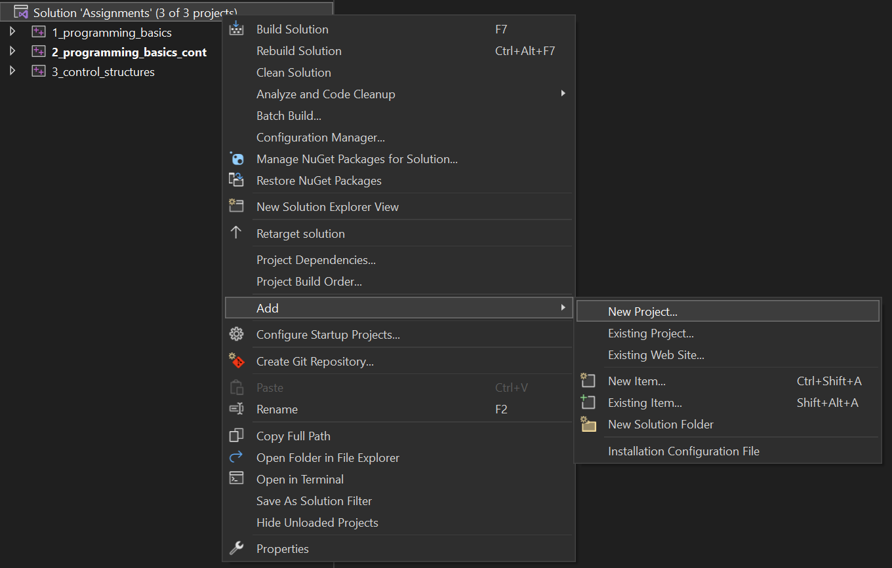

# VRAC REU Programming
Use this repository to refer back to what we learned in the lab. You can copy and paste code from these files as a starting point for your mini assignments.

**/snippets** -> contains code snippets from what we learned in the lab lectures  
**/challenges** -> contains coding challenges 
**/images** -> Contains local images used in Readme (disregard this folder)

## 🚨 Challenges 📝
In the **/challenges** folder, you will find small coding challenges to help you practice the concepts we've learned in the lab. You can use code from the **/snippets** folder to help you solve the problems!

Add a new project to your solution for each new challenge.

# Visual Studio 👨‍💻
## Project Structure
Visual Studio applications are organized into **solutions** and **projects**. A solution is a collection of projects. A project is a collection of files that are compiled together. Everytime you create a new file with a **main()** function, you will need to create a new project!

You have ALREADY created a **solution** called *Assignments*, which contains all your projects. Continue to add projects to this solution for future work (challenges, lecture, ...etc)

## Creating a Project
1. Right click on the solution name in the **Solution Explorer** window.
2. Select **Add** -> **New Project**.

3. Highlight **Console App** and click **Next**.
4. Name your project (UpperCamelCase) and click **Create**.

*A new project should automatically initialize a .cpp file with a **main()** function. If it doesn't, you can add a new file to the project (see below)*

## Adding Files to a Project
1. Right click on the project name in the **Solution Explorer** window.
2. Select **Add** -> **New Item**.

3. Highlight **C++ File (.cpp)**.
4. Name your file (lowerCamelCase) and click **Add**.
5. Add include statements and a **main()** function to your new file (if necessary).
```{c++}
#include <iostream>

int main() {
    // Code goes here
}
```

## Running a Project
1. If the project you want to run is not already highlighted in the **Solution Explorer** window, right click on the project name and select **Set as Startup Project**.
3. Click the green **Start** button at the top of the screen.
