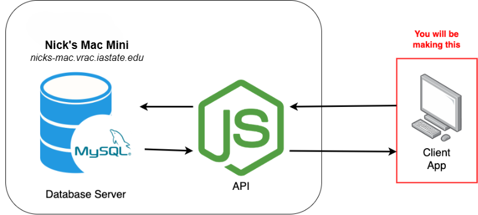

# REUChat Client-Side Application in C++
Author: Nicholas Matthews

## Motivation
Many projects at the VRAC involve multiple computers and applications that work together as a system. The C6 is a prime example of several computers communicating over a network. Within these, software libraries and application also need be cohesive and reliable. In this mini project, you will be creating a client-side application to a chat server system.

## Description
A MySQL database server and Node.js Express API have been set up on Nick’s Mac Mini in the VRAC. The database contains a single table of chat messages from REU students, and the Node.js API provides an easy way of programmatically fetching and adding chat messages into the database. The only this missing is a client-side application for sending and recieving chats. The architecture for the system is shown below…

### Ask Nick for the full URL of Nick's PC**

  
Feel free to look at the code for the Node.js API in **api/** folder if you want!

## Task
Your job will be to create a **user-friendly** C++ console application which will be able to accomplish two tasks:
1. Fetch messages from the database on Nick's server and display them to your console
2. Send messages to the database on Nick's server

### What you will learn
- Creating a program control flow  
- Sending/recieving data accross a network using HTTP
- Manipulating string data

# Walkthrough

## Create a New Project
Create a new project with the name *ReuChat*

Instructions for creating a new project are in [README](https://github.com/nickd-ISU/reu-cpp-snippets/blob/main/README.md) under "Creating a Project"

## Add the HTTP GET and POST Functions
In order to interact with the database on Nick's PC, you need to send HTTP commands to the Node.js API using C++ code.

However, there is no native library for sending HTTP using C++. So, I created a couple of functions that will do it for you. They work by calling the *curl* command as a subprocess on your computer. Copy and paste these two functions above your main function.

```cpp
// GET returns a string representation of a list of ALL chat messages in the database
std::string GET(std::string url) {
    std::string cmd = "curl -s -w \\n%{http_code} " + url;
    FILE* p = _popen(cmd.c_str(), "r");
    char buffer[2];
    std::string body;
    if (!p) {
        return "Error running curl command";
    }
    while (fgets(buffer, sizeof(buffer), p)) {
        body += buffer;
    }
    std::string status = body.substr(body.find_last_of('\n') + 1);
    if (status == "200") {
        return body.substr(0, body.find_last_of('\n'));
    }
    else if (status == "404") {
        std::cout << "404 Not Found: Make sure the URL is correct" << std::endl;
    }
    else if (status == "500") {
        std::cout << "500 Internal Server Error: The server is not responding" << std::endl;
    }
    else if (status == "000") {
	std::cout << "000 Error: Make sure the URL is correct" << std::endl;
    }
    else {
        std::cout << "Error: " << status << std::endl;
    }
}

// POST sends a message to be stored in the database. If successful, it returns the string "200"
std::string POST(std::string url, std::string message) {
    std::string cmd = "curl -s POST -d \"chat=" + message + "\" " + url;
    FILE* p = _popen(cmd.c_str(), "r");
    char buffer[2];
    std::string body;
    if (!p) {
        return "Error running curl command";
    }
    while (fgets(buffer, sizeof(buffer), p)) {
        body += buffer;
    }
    if (body == "200") {
        return "200";
    }
    else {
        std::cout << "Error inserting message: Make sure the URL is correct" << std::endl;
    }
    return body;
}
```

Now we are ready to start coding!

## Recommended Steps
1. Plan out how you want the program to flow. What should the user see when they first run the program? Will the program loop until the user quits? What should the user see when they quit?
2. Get the functions working. See if you can get the GET function to return a list of chat messages. Then, see if you can get the POST function to send a message to the database.
3. Once you have the functions working, you can start to build the program around them. Make the program user-friendly by adding prompts and displaying the chat messages in a readable format. It may be worth looking into splitting up the big chat string returned by the GET function into a vector of strings.
